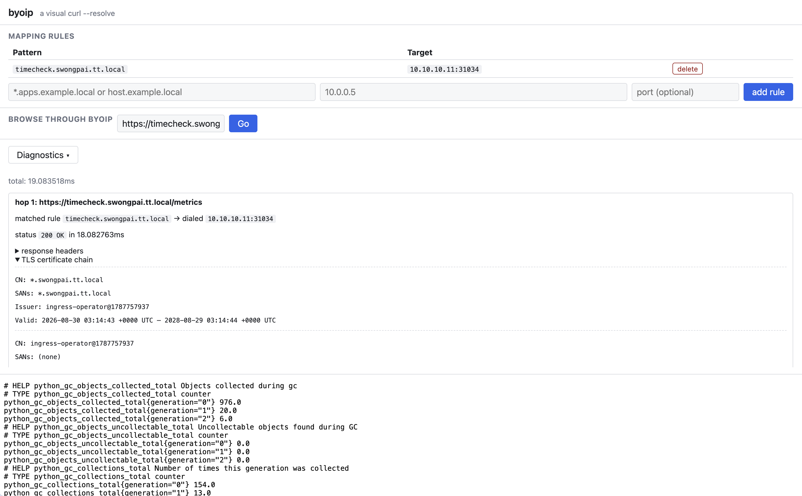

# byoip

A visual `curl --resolve`. Add a rule like `*.apps.swongpai.local → 10.0.0.5`, browse `https://console.apps.swongpai.local/` through the tool, and see the site render — before any real DNS record exists.

Single Go binary, zero third-party dependencies — works unmodified in a fully disconnected (air-gapped) OpenShift cluster.



## Why

It was built to test an **OpenShift IngressController exposed via NodePort**, where the router answers on a node IP at a high port (`10.10.10.11:31034` above) but every route still expects its real hostname in the `Host` header and TLS SNI. Hitting the NodePort directly gets you the default backend; adding a `/etc/hosts` entry can't express a port; and `curl --resolve` proves the connection works but won't show you the page. byoip closes that gap: map `hostname → nodeIP:nodePort`, then browse the route as the cluster will serve it once DNS and a load balancer are in place. The diagnostics confirm you reached the right router — the screenshot's `ingress-operator` wildcard cert is proof the OpenShift ingress stack answered, not something else on that port.

Nothing about it is OpenShift-specific, though. Anything that keys off the hostname works the same way: validating a new LB VIP before the DNS cutover, previewing a vhost on a staging server, reaching a service through a jump host's port forward, or checking which certificate a given IP actually presents for a name.

## Features

- **DNS-free browsing** — hostnames resolve against your in-memory rule table (exact or `*.suffix` wildcard, optional `:port` override), never real DNS. Connections dial the mapped IP while preserving the original `Host` header and TLS SNI.
- **In-page rendering** — the proxied site renders in an iframe; links, redirects, and assets are rewritten to stay inside the proxy so you can click through across subdomains.
- **Diagnostics panel** — matched rule, dialed address, HTTP status, response headers, TLS certificate chain (CN, SANs, issuer, expiry), and timing per fetch.
- **Actionable errors** — an unmapped host shows a pre-filled "add rule" form; a dead IP fails in ~4s with the exact reason.
- **HTTPS with any cert** — verification is skipped by design (you're testing infra that has no valid certs yet); the cert details are shown instead.

## Build

```sh
podman build -t byoip:latest .
```

For disconnected mirrors, override the base images:

```sh
podman build \
  --build-arg BUILD_IMAGE=my-mirror.local/ubi9/go-toolset:latest \
  --build-arg RUNTIME_IMAGE=my-mirror.local/ubi9/ubi-micro:latest \
  -t byoip:latest .
```

The build stage sets `GOPROXY=off`, so it fails loudly if a non-stdlib dependency is ever introduced.

## Run locally

```sh
podman run --rm -p 8080:8080 byoip:latest
```

Open <http://localhost:8080/>, add a rule, type a URL, hit Go.

## Deploy to OpenShift

Edit the `image:` in `deploy/deployment.yaml` to a registry your cluster can pull from, then:

```sh
oc apply -f deploy/
```

The Deployment is written for the `restricted-v2` SCC (arbitrary UID, read-only root FS, all capabilities dropped); the Route is edge-terminated TLS with HTTP→HTTPS redirect.

## Configuration

| Env var | Default | Meaning |
| --- | --- | --- |
| `TIMEOUT_SECONDS` | `4` | Connect + TLS handshake + response-header timeout for proxied fetches. |

## Limitations

- Rules are in-memory, global, and cleared on pod restart — no persistence, no auth, single replica.
- URL rewriting is regex-based over HTML/CSS; URLs constructed by JavaScript at runtime are not rewritten, so JS-heavy SPAs may not fully render.
- Cookies pass through best-effort; proxied hosts share the tool's origin.
- IPv4 targets only. No WebSockets, no metrics.
- TLS verification to targets is intentionally disabled — do not expose byoip on an untrusted network.
